# Lecture 1

## Today
* Course Info
* What is computation
* Python basics
  * Mathematical operatiosn
  * Python variables and types
* **NOTE:** slides and code files up before each lecture
  * Highly encourage you to download them before class
  * Take notes and run code files when I do
  * Do the in-class "You try it" breaks
  * Class will not be recorded
  * Class will be live-Zoomed for those sick/quarantine

## Why Come To Class?
* You get out of this course what you put into it
* Lectures
  * **Intuition** for concept
  * **Teach** you the concept
  * **Ask** me questions!
  * **Examples** of concept
  * Opportuntity to **practice practice practice**
  * Repeat

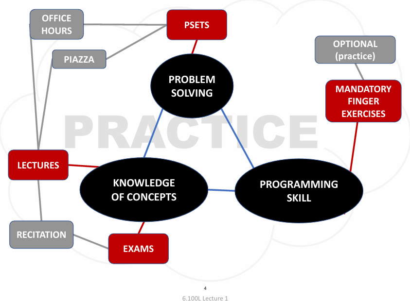

## Topics
* Solving problems using **computation**
* Python **programming language**
* Organizing **modular programs**
* Some simple but important **algorithms**
* Algorithmic **complexity**

LET'S GOOO!

## Types of Knowledge
* **Declarative knowledge** is statements of fact
* **Imperative knowledge** is a recipe or "how-to"
* Programming is about writing recipes to generate facts

## Numerical Example
* Square root of a number `x` is `y` such that `y*y = x`
* Start with a **guess**, `g`
   1) If `g*g` is **close enough** to `x`, stop and say `g` is the answer
   2) Otherwise make a **new guess** by averaging `g` and `x/g`
   3) Using the new guess, **repeat** process until close enough
* Let's try it for x = 16 and an initial guess of 3
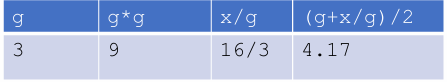
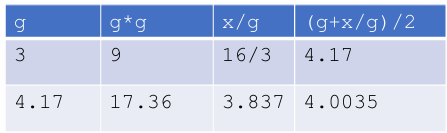
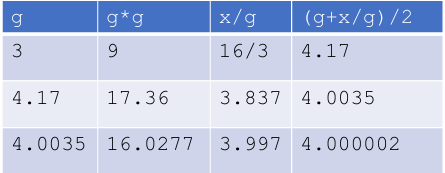

## We Have an Algorithm
1) Sequence of simple **steps**
2) **Flow of control** process that specifies when each step is exectued
3) A means of determining **when to stop**

## Algorithms are Recipes / Recipes are Algorithms
* Bake cake from a box
   1) Mix dry ingredients
   2) Add eggs and milk
   3) Pour mixture in a pan
   4) Bake at 350F for 5 minutes
   5) Stick a toothpick in the cake
   6) * a. If toothpick does not come out clean, repeat step 4 and 5 
      * b. Otherwise, take pan out of the oven
   7) Eat

## Computers are Machines that Execute Algorithms
* Two things computers do:
  * Performs simple **operations** 100s of billions per second!
  * **Remembers** results
  * 100s of GBs of storage!
* What kinds of calculations?
  * **built-in** to the machine, e.g., +
  * Ones that **you define** as the programmer
* The BIG IDEA here?
   * A COMPUTER WILL ONLY DO WHAT YOU TELL IT TO DO 
* **Fixed program** computer
  * Fixed set of algorithms
  * What we had until 1940s
* **Stored program** computer
  * Machine stores and executes instructions
* **Key insight:** Programs are no different from other kinds of data

## Stored Program Computer
* Sequence of **instructions stored** inside computer
  * Built from predefined set of primitive instructions
  1) Arithmetic and logical
  2) Simple tests
  3) Moving data
* Special program (interpreter) **executes each instruction in order**
  * Uses tests to change flow of control through sequence
  * Stops when it runs out of instructions or executes a halt instruction

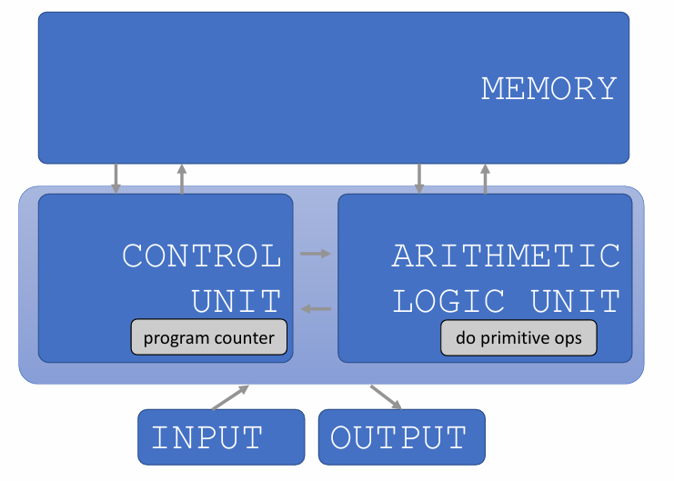
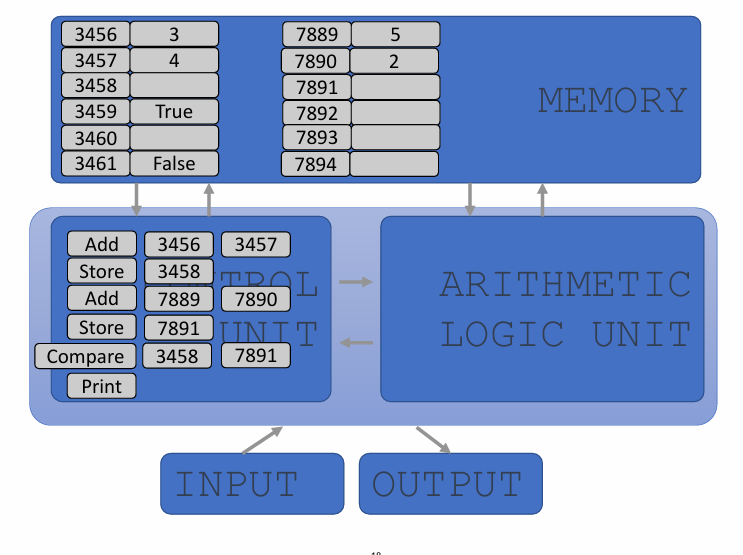
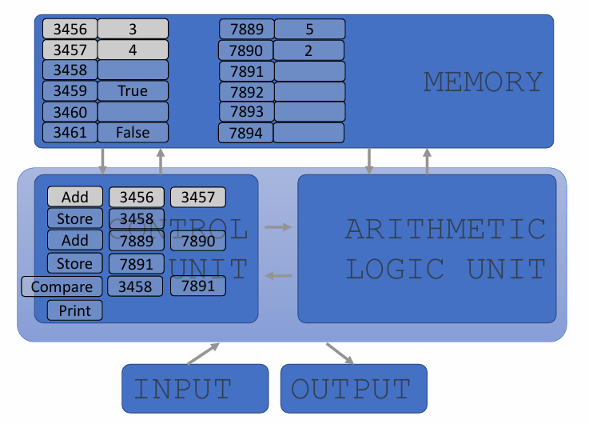
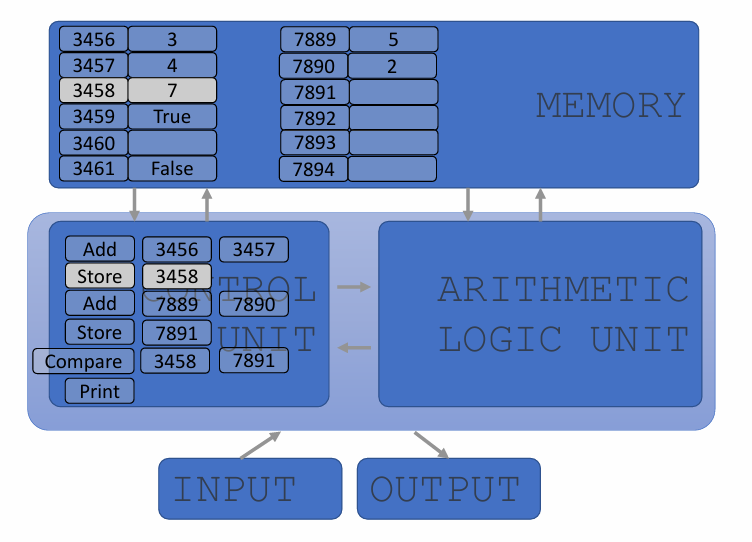
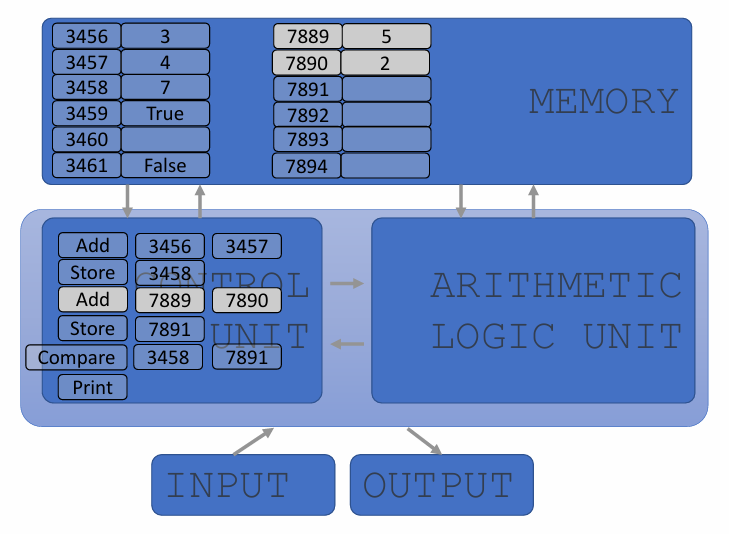
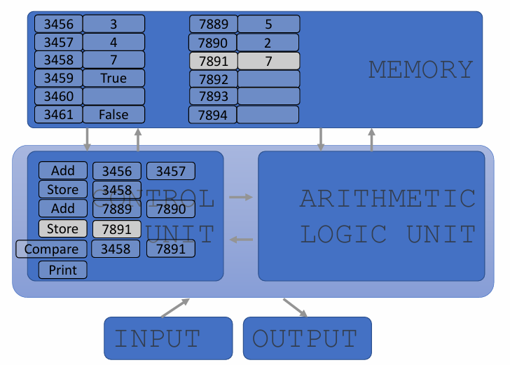
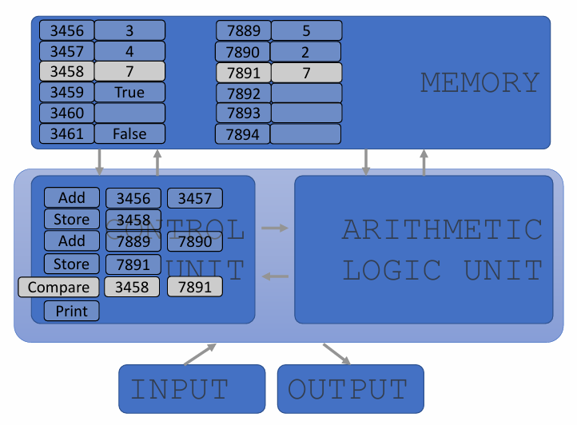
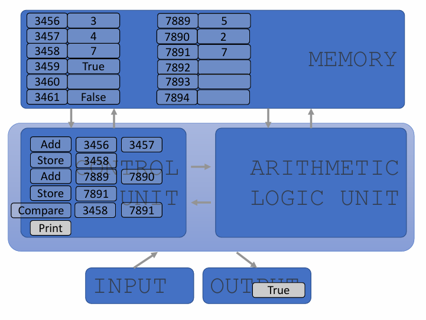

## Basic Primitives
* Turing showed that you can **compute anything** with a very simple machine with only 6 primitives: left, right, print, scan, erase, no op
  * 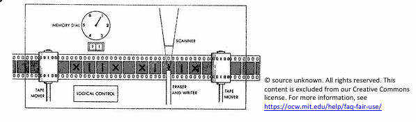
* Real programming languages have
  * More convenient set of primitives
  * Ways to combine primitives to **create new primitives**
* Anything computable in one language is computable in any other programming language

## Aspects of Languages
* **Primitive constructs**
  * English: words
  * Programming language: numbers, strings, simple operators
* * English: `"cat dog boy"`  => not syntactically valid
  * `"cat hugs boy"` => syntactically valid
* Programming language: `"hi"5` => not syntactically valid
  * `"hi"*5` => syntactically valid
* **Static semantics**: which syntactically valid strings have meaning
  * English: `"I are hungry"` => syntactically valid but static semantic error
  * PL: `"hi"+5` => syntactically valid but static semantic error
* **Semantics:** the meaning associated with a syntactically correct string of symbols with no static semantic errors
* English: can have many meanings `"The chicken is ready to eat."`
* Programs have only one meaning
* **But the meaning may not be what programmer intended**

## Where Things Go Wrong
* **Syntactic errors**
  * Common and easily caught
* **Static semantic errors**
  * Some languages check for these before running program
  * Can cause unpredictable behavior
* No linguistic errors, but **different meaning than what programmer intended**
  * Program crashes, stops running
  * Program runs forever
  * Program gives an answer, but it's wrong!

## Python Programs
* A **program** is a sequence of defintions and commands 
  * Definitions **evaluated**
  * Commands **executed** by a Python interpreter in a shell
* **Commands** (statements) instruct interpreter to do something
* Can be typed directly in a **shell** or stored in a **file** that is read into the shell and evaluated
  * Problem Set 0 will introduce you to these in Anaconda

## Programming Environment: Anaconda

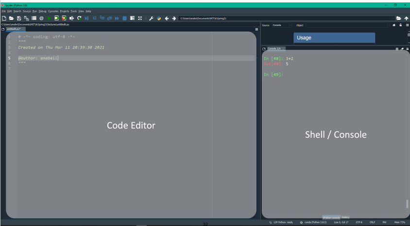

## Objects
* Programs manipulate **data objects**
* Objects have a **type** that defines the kinds of things programs can do to them
  * `30`
    * Is a number
    * We can add/sub/mult/div/exp/etc
  * `'Ana'`
    * Is a sequence of characters (aka a string)
    * We can grab substrings, but we can't divide it by a number
* **Scalar** (cannot be subdivided)
  * Numbers: 8.3, 2
  * Truth value: True, False
* **Non-scalar** (have internal structure that can be accessed)
  * Lists
  * Dictionaries
  * Sequence of characters: "abc"

## Scalar Objects
* `int` - represent **integers**, ex. `5`, `-100`
* `float` - represent **real numbers**, ex. `3.27`, `2.0`
* `bool` - represent **Boolean** values `True` and `False`
* `NoneType` - **special** and has one value, `None`
* Can use `type()` to see the type of an object

```sh
>>> type(5)
int
>>> type(3.0)
float
```
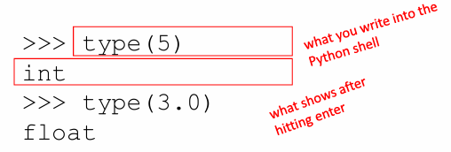

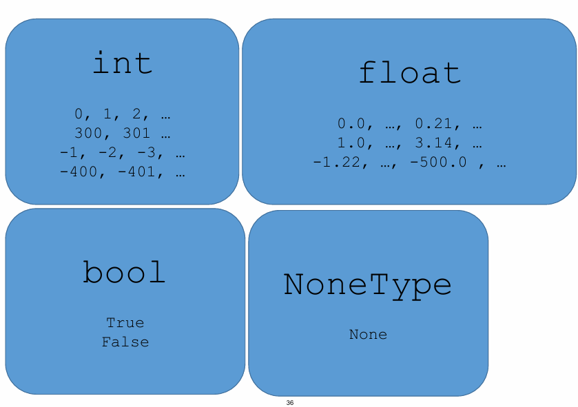

## YOU TRY IT!
* In your console, find the type of:
  * `1234`
    * int
  * `8.99`
    * float
  * `9.0`
    * float
  * `True`
    * bool
  * `False`
    * bool

## Type Conversions (Casting)
* Can **convert object of one types to another**
  * `float(3)` casts the int `3` to float `3.0`
  * `int(3.9)` casts (note the truncation!) the float `3.9` to int `3`
* Some operatoins perform implicit casts
  * `round(3.9)` returns the int `4`

## YOU TRY IT!
* In your console, find the type of:
  * `float(123)`
    * float
  * `round(7.9)`
    * int
  * `float(round(7.2))`
    * float
  * `int(7.2)`
    * int
  * `int(7.9)`
    * int

## Expressions
* **Combine objects and operators** to form expressions
  * 3+2
  * 5/3
* An expression has a **value**, which has a type
  * 3+2 have value 5 and type int
  * 5/3 has value 1.666667 and type float
* Python evaluates expressions and stores the value. It doesn't store expressions!
* Syntax for a simple expression
  * `<object> <operator> <object>`

