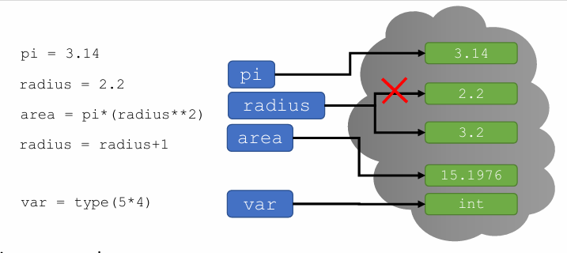
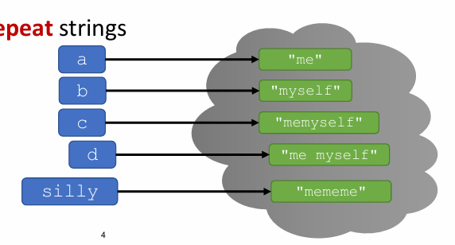

# Strings, Input/Output, and Branching

## Recap


* Objects
  * Objects in memory have **types**
  * Types tell Python what **operations** you can do with the objects.
  * **Expressions evaluate to one value** and involve objects and operations
  * Variables bind names to objects
  * = sign is an assignment, for ex. `var = type(5*4)`
* Programs
  * Programs only **do what you tell them to do**
  * Lines of code are executed **in order**
  * Good variable names and comments help you **read code later**

## Strings
* Think of a `str` as a **sequence** of case sensitive characters
  * Letters, special characters, spaces, digits
* Enclose in **quotation marks or single quotes**
  * Just be consistent about the quotes
    ```py
    a = "me"
    z = 'you'
    ```
* **Concatenate** and **repeat** strings
  ```py
  b = "myself"
  c = a + b
  d = a + " " + b
  silly = a * 3
  ```

    

## You Try It!
What's the value of s1 and s2?
* ```py
  b = ":"
  c = ")"
  s1 = b + 2*c
  ```
  * `s1 == ":))"`
* ```py
  f = "a"
  g = " b"
  h = "3"
  s2 = (f+g) * int(h)
  ```
  * `s2 == 'a ba ba b'`

## String Operations
* `len()` is a function used to retrieve the **length** of a string in the parentheses

```py
s = "abc"
len(s) # => evaluates to 3
chars = len(s) # Expression that evaluates to 3
```

## Slicing to get One Character in a String
* Square brackets used to perform **indexing** into a string to get the value at a certain index/position

```py
s = "abc"
# index: 0 1 2 <= indexing always starts at 0
# index: -3 -2 -1 <= index of last element is len(s) - 1 or -1

s[0] => evaluates to "a"
s[1] => evaluates to "b"
s[2] => evaluates to "c"
s[3] => trying to index out of bounds error

s[-1] => evaluates to "c"
s[-2] => evaluates to "b"
s[-3] => evaluates to "a"
```